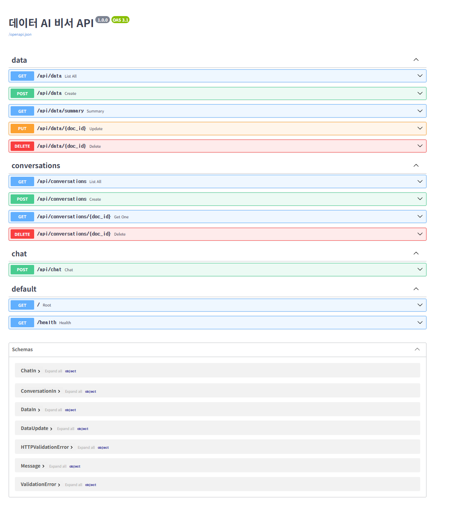
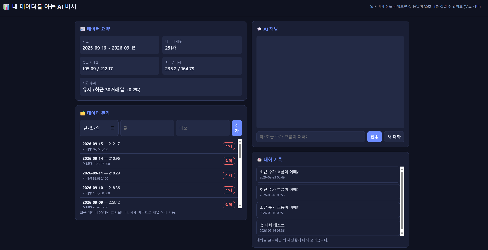
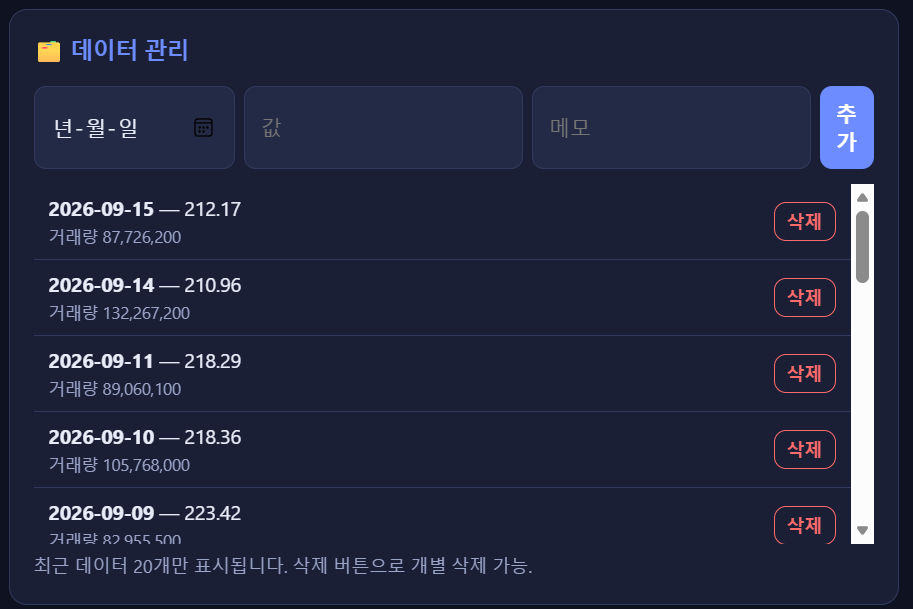
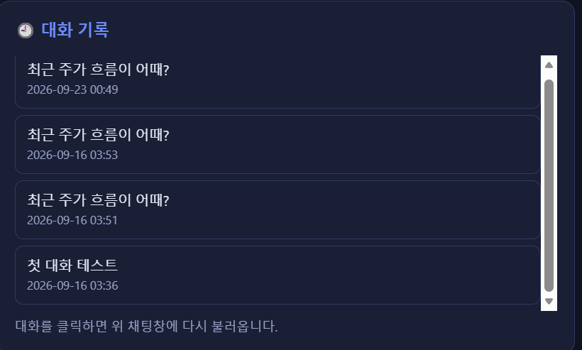

# 내 데이터를 아는 AI 비서 (Data-Aware AI Assistant)

내 주식 시세 데이터를 이해한 상태로 대화하는 AI 웹 서비스. 시세를 저장·요약해 두고, 질문하면 실제 수치를 근거로 답한다.

- **라이브 데모**: https://data-ai-assistant-brown.vercel.app/
- **API 문서**: https://data-ai-assistant.onrender.com/docs

## 만든 이유

일반 챗봇에 "최근 주가 흐름 어때?"라고 물으면 원론적인 답만 돌아온다. 내 데이터를 모르기 때문이다.
그때그때 수치를 복사해 붙여 넣으면 되지만, 데이터가 쌓일수록 매번 붙여 넣는 것도, 긴 표를 통째로 넘기는 것도 비효율적이다.

그래서 데이터를 미리 저장해 두고, 질문이 들어오면 서버가 먼저 그 데이터를 요약해 모델에 함께 넘기는 구조를 만들었다.
사용자는 수치를 옮길 필요 없이 질문만 하면 되고, 모델은 "현재가는 기간 평균보다 약 8.8% 높다"처럼 실제 값을 근거로 답한다.

## 배포 링크

| 구분 | URL |
|------|-----|
| 백엔드 (API / Swagger) | https://data-ai-assistant.onrender.com/docs |
| 프론트엔드 (웹 서비스) | https://data-ai-assistant-brown.vercel.app/ |

## 다루는 데이터

데이터 주제를 고를 때 세 가지 기준을 먼저 세웠다. (1) 시간에 따라 변하는 시계열일 것 — 요약·추세가 의미를 가지려면 필요하다. (2) 어느 정도 변동성이 있을 것 — 값이 거의 안 변하면 "데이터를 안다"는 걸 보여주기 어렵다. (3) 키 발급 없이 무료로 수집할 수 있을 것.

이 기준에 주식 시세가 맞았고, 그중 변동성이 큰 NVDA(엔비디아) 종목을 골랐다.
수집은 `yfinance` 라이브러리를 썼다. 별도 API 키가 필요 없고, 한 줄로 1년치 일별 시세를 받을 수 있어 위 세 번째 기준에 부합한다.

- 출처: Yahoo Finance (`yfinance`)
- 종목·기간: NVDA, 최근 1년 (`period="1y"`) → 약 252 거래일, 실제 저장 251건
- 필드: 날짜(`date`, YYYY-MM-DD), 종가(`value`, 소수점 2자리), 거래량(`memo`)

값으로 종가를 택한 건, 하루의 시세를 대표하는 값이고 평균·추세 계산의 기준으로 가장 흔히 쓰이기 때문이다.

## 주요 기능

- **데이터 요약**: 기간, 개수, 평균·최신·최고·최저, 최근 추세를 한 화면에 표시
- **AI 채팅**: 데이터 요약을 프롬프트에 주입해 실제 수치 기반으로 답변 (응답 대기 중 로딩 표시)
- **데이터 관리**: 새 데이터 추가, 목록 조회, 개별 삭제
- **대화 기록**: 이전 대화를 저장하고 목록에서 클릭해 다시 불러오기

## 기술 스택

| 영역 | 기술 |
|------|------|
| 백엔드 | Python, FastAPI |
| 프론트엔드 | Vanilla HTML / CSS / JavaScript |
| 데이터베이스 | Firebase Firestore |
| AI | OpenAI 호환 API (모델 `gpt-5-mini`) |
| 배포 | 백엔드 Render / 프론트 Vercel |

이 구성은 과제에서 지정된 스택이다. 각 도구가 이 프로젝트에 맞았던 지점만 덧붙이면,
FastAPI는 Swagger 문서가 자동 생성돼 API 확인·검증이 쉬웠고, Firestore는 스키마 정의 없이 시세 레코드와 대화 기록을 문서 단위로 나눠 담기 편했다.
프론트가 파일 하나로 끝나 Vercel 정적 배포와 잘 맞은 것도 이 조합의 이점이었다.

AI 모델은 과제에서 제공한 OpenAI 호환 엔드포인트의 `gpt-5-mini`를 사용한다. 표준 OpenAI 주소가 아니므로 엔드포인트 주소를 코드에 박지 않고 환경변수(`OPENAI_BASE_URL`)로 뺐다.

## 동작 원리

```
[Firestore 시계열 데이터]
        │
        ▼
[요약·분석]  기간 / 개수 / 평균·최고·최저 / 최근 추세 계산
        │
        ▼
[시스템 프롬프트 주입]  "당신은 사용자의 데이터를 분석해주는 AI 비서입니다 … [요약]"
        │
        ▼
[OpenAI 호환 API]  요약 + 이전 대화 + 질문으로 답변 생성
        │
        ▼
[대화 기록 저장(Firestore)] → 프론트에 응답 표시
```

가장 고민한 지점은 데이터를 모델에 어떻게 넘기느냐였다.
처음엔 대화마다 레코드 251건을 통째로 프롬프트에 붙이는 방법을 생각했는데, 데이터가 늘수록 토큰이 선형으로 불어나고 모델 컨텍스트 한계에도 걸린다.
그래서 서버에서 먼저 요약을 계산하고 그 요약만 주입하는 구조로 갔다. 데이터가 몇 건이든 프롬프트 길이는 거의 일정하게 유지된다.

요약에 무엇을 담을지는 "사용자가 데이터에 대해 물을 법한 것"을 기준으로 정했다. 지금 값은 얼마인지(최신), 평소와 비교해 높은지 낮은지(평균·최고·최저), 요즘 오르는지 내리는지(추세). 이 기준을 대입해 다음을 계산한다.

- **기간**: 첫 날짜 ~ 마지막 날짜
- **개수**: 전체 레코드 수
- **평균·최고·최저·최신**: 종가 기준 (평균은 소수점 2자리)
- **추세**: 최신값과 30거래일 전 값의 변화율로 판정
  - 변화율 = (최신 − 30거래일 전) / 30거래일 전 × 100
  - **+3% 초과 → 상승 / −3% 미만 → 하락 / 그 사이 → 유지**
  - 예: `유지 (최근 30거래일 +0.2%)`

추세 창을 30거래일로 잡은 건 대략 한 달치 거래일에 해당해 "최근 흐름"의 체감 단위와 맞기 때문이고, ±3% 임계치는 일별 종가의 일상적인 등락(노이즈)을 넘어서는 변동만 방향으로 인정하기 위한 기준이다. 데이터가 30건보다 적으면 있는 만큼만으로 계산한다.

## 프로젝트 구조

```
data-ai-assistant/
├── app/
│   ├── main.py            # FastAPI 진입점: 라우터 등록, config 기반 CORS 설정
│   ├── config.py          # 환경변수 로딩 (dotenv) — OpenAI/Firebase/CORS 값
│   ├── database.py        # Firestore 초기화 및 db 클라이언트 제공
│   ├── models/
│   │   └── schemas.py     # Pydantic 스키마 (DataIn, DataUpdate, ChatIn 등)
│   ├── routers/
│   │   ├── data.py        # 데이터 CRUD + /summary (요약은 service에 위임)
│   │   ├── conversations.py  # 대화 기록 API
│   │   └── chat.py        # 챗봇 API (요약 주입 + 모델 호출)
│   └── services/
│       ├── data_service.py   # 데이터 조회·요약 호출
│       └── chat_service.py   # 시스템 프롬프트 구성 + 모델 호출
├── analyze.py             # 요약·추세 계산 로직 (make_summary)
├── fetch_data.py          # yfinance로 시세 수집
├── seed_data.py           # 수집 데이터를 Firestore에 적재
├── data.json              # 수집 원본 데이터
├── requirements.txt
├── runtime.txt            # Render용 Python 버전 지정
└── README.md
```

라우터와 서비스를 나눈 이유는, 엔드포인트 정의와 실제 계산 로직을 분리해두면 요약 방식을 바꿀 때 라우터를 건드리지 않아도 되기 때문이다.
실제로 추세 계산 기준(30거래일, ±3%)을 조정하려면 `analyze.py`만 고치면 되고, API 쪽 코드는 그대로다.

## API 엔드포인트

| 메서드 | 경로 | 설명 |
|--------|------|------|
| GET | `/` | 루트 (상태 확인) |
| GET | `/health` | 헬스 체크 |
| GET | `/api/data` | 전체 데이터 조회 |
| POST | `/api/data` | 데이터 추가 |
| GET | `/api/data/summary` | 데이터 요약(기간/통계/추세) |
| PUT | `/api/data/{doc_id}` | 데이터 수정 |
| DELETE | `/api/data/{doc_id}` | 데이터 삭제 |
| GET | `/api/conversations` | 대화 기록 목록 |
| POST | `/api/conversations` | 대화 생성 |
| GET | `/api/conversations/{doc_id}` | 특정 대화 조회 |
| DELETE | `/api/conversations/{doc_id}` | 대화 삭제 |
| POST | `/api/chat` | 챗봇 대화 (요약 주입 + 응답 생성) |

## 환경 변수

민감한 값은 코드에 박지 않고 전부 환경변수로 뺐다. 로컬에서는 `.env` 파일로, 배포 환경에서는 각 플랫폼의 환경변수로 주입한다.

| 변수 | 설명 |
|------|------|
| `OPENAI_API_KEY` | 모델 API 키 |
| `OPENAI_BASE_URL` | OpenAI 호환 엔드포인트 주소 |
| `FIREBASE_SERVICE_ACCOUNT_JSON` | Firebase 서비스 계정 JSON (문자열 전체) |
| `ALLOWED_ORIGINS` | CORS 허용 도메인 (기본값 `*`) |

Firebase 인증은 두 갈래로 처리했다. 로컬에서는 서비스 계정 키 파일을 읽지만, Render 같은 배포 환경에는 키 파일을 올릴 수 없다(깃에 커밋하면 키가 유출된다).
그래서 배포 환경에서는 JSON 전체를 환경변수 문자열로 넣고, `database.py`가 둘 중 가능한 쪽을 자동으로 택하게 했다. 키 파일과 `.env`는 `.gitignore`로 커밋에서 제외했다.

프론트엔드는 백엔드 주소를 `frontend/index.html` 상단의 `API_BASE_URL` 상수로 관리한다.
정적 사이트는 빌드 단계가 없어 런타임에 환경변수를 주입할 방법이 없으므로, 상수 한 곳에서 주소를 바꾸는 방식이 현실적인 선택이었다. API 키 같은 비밀값은 프론트에 두지 않고 백엔드에만 둔다.

## 로컬 실행

백엔드
```bash
pip install -r requirements.txt
# .env 파일에 위 환경변수 채우기
uvicorn app.main:app --reload
# → http://127.0.0.1:8000/docs 에서 API 확인
```

프론트엔드
```bash
# frontend/index.html 을 브라우저로 열기만 하면 된다.
# (API_BASE_URL 이 배포된 백엔드를 가리키면 로컬 서버 없이도 동작)
```

## 배포

백엔드는 파이썬 프로세스를 상시 띄워야 해서 Render, 프론트는 정적 파일이라 Vercel로 나눠 배포했다. 각 특성에 맞는 플랫폼에 올리면 설정이 단순하고 문제 추적도 쉽다.

백엔드 (Render)
1. GitHub 저장소를 Render Web Service로 연결
2. Build Command: `pip install -r requirements.txt`
3. Start Command: `uvicorn app.main:app --host 0.0.0.0 --port $PORT`
4. 환경변수 4개 등록 후 배포

프론트엔드 (Vercel)
1. 같은 저장소를 Vercel로 import
2. Root Directory 를 `frontend` 로 지정 (정적 사이트로 인식됨)
3. 배포된 URL을 위 "배포 링크"에 기입

## 예외 처리와 한계

동작하는 경우만 정리하지 않기 위해, 실패할 때 어떻게 되는지와 아직 처리하지 못한 부분을 구현/미구현으로 나눠 적는다.

**구현된 처리**
- 모델 호출 실패 시: 백엔드 챗봇에서 예외를 잡아 `AI 응답 생성 실패` 메시지를 반환한다. 요청 하나가 실패해도 서버가 죽지 않는다.
- 프론트 통신 실패 시: 응답을 못 받으면 채팅창에 오류 안내 문구를 표시하고, 대기 중에는 로딩 표시를 띄운다.
- 콜드스타트: Render 무료 플랜은 유휴 시 인스턴스가 잠들어 첫 요청이 30초~1분 걸린다. 사용자가 당황하지 않도록 화면 상단에 안내 문구를 넣었다.
- 인증 정보 유출 방지: 키 파일과 `.env`를 `.gitignore`로 제외했고, 배포 환경에서는 환경변수로만 주입한다.

**미구현 (다음 개선 과제)**
- **사용자 인증 없음**: API가 공개돼 있어 주소만 알면 누구나 데이터를 추가·삭제할 수 있다. 단일 사용자 데모라 우선 열어뒀고, 운영하려면 로그인·토큰 인증이 필요하다. (미구현)
- **CORS 전체 허용**: 개발 편의를 위해 모든 출처(`*`)를 열어둔 상태다. 실제로는 배포된 프론트 도메인만 허용하도록 좁혀야 한다. (미구현)
- **대화 중복 저장**: 매 응답이 새 대화로 저장돼 기록 목록에 같은 질문이 여러 번 쌓인다. 세션 단위로 묶는 정리가 필요하다. (미구현)
- **입력값 검증 최소**: 날짜·값 형식 정도만 확인하고, 값의 정상 범위 검증은 없다. (미구현)
- **단일 종목**: 지금은 NVDA 한 종목만 다룬다. 심볼로 구분해 여러 종목을 저장·조회하도록 확장할 수 있다. (미구현)
- **진행 중 대화 문맥은 브라우저에만 존재**: 현재 대화 맥락이 프론트 변수에 있어 새로고침하면 초기화된다(누적 기록 자체는 Firestore에 남는다). 서버 세션으로 옮기면 해결된다. (미구현)

한계도 분명히 해둔다. 요약은 평균·최고·최저·추세 같은 기초 통계일 뿐 예측이나 기술적 분석이 아니며, 투자 판단의 근거가 될 수 없다. 또 모델에는 원본이 아니라 요약만 주입하므로, "특정 날짜의 값"처럼 원본을 뒤져야 하는 질문에는 약하다.

## 스크린샷

| 화면 | 이미지 |
|------|--------|
| 배포된 Swagger 문서 |  |
| AI 채팅 + 데이터 요약 |  |
| 데이터 관리 |  |
| 대화 기록 불러오기 |  |
